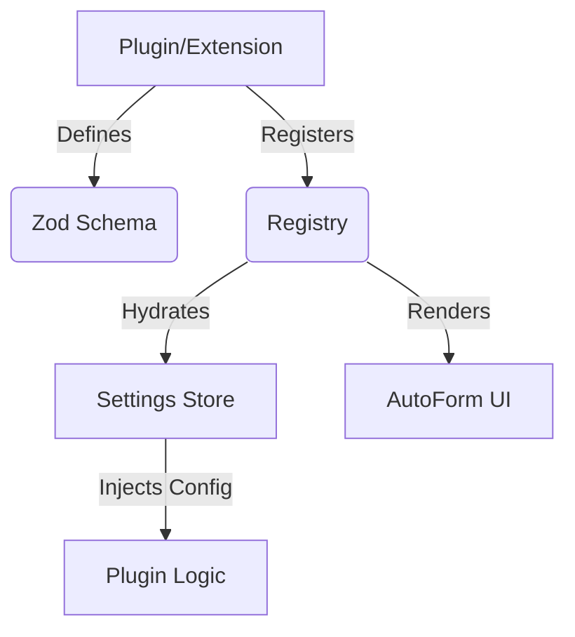

# Modularity & Extensibility Design Bible

**Status:** Draft / Proposal
**Context:** Character Foundry Family (Architect, Federation, Archive)
**Goal:** Unify extension, settings, and provider management into a schema-driven architecture.

---

## 1. The Core Philosophy

> **"Define once, run everywhere."**

We are currently manually building UI components (React forms, inputs, state management) for every new setting, provider, or feature. This is unmaintainable and leads to inconsistency.

The new architecture flips this:
1.  **Define the Data Shape:** Use **Zod** to define the configuration schema.
2.  **Auto-Generate the UI:** The system generates the Settings UI, validation logic, and persistence layer automatically.
3.  **Inject the Behavior:** Plugins register *handlers* that consume this strictly-typed configuration.

---

## 2. Architecture Overview

We will introduce a new shared package (likely `@character-foundry/app-framework` or `@character-foundry/runtime`) to house these primitives.



---

## 3. The Registry System

The core of the modularity is a robust Registry pattern.

### 3.1 The `Extension` Interface

Every modular piece of code (internal or external) is an `Extension`.

```typescript
import { z } from 'zod';

export interface Extension<TConfig extends z.ZodType> {
  id: string;              // e.g., "com.foundry.openai"
  name: string;            // e.g., "OpenAI Provider"
  version: string;
  
  // Configuration Schema (The Source of Truth)
  configSchema: TConfig;
  
  // Optional: Default configuration
  defaultConfig?: z.infer<TConfig>;

  // Lifecycle
  onActivate?: (context: ExtensionContext<z.infer<TConfig>>) => void;
  onDeactivate?: () => void;
}
```

### 3.2 The Registries

We need specific registries for different domain concepts.

#### A. Settings Registry
Allows extensions to inject panels into the main application settings.

```typescript
registry.settings.register({
  id: 'editor-core',
  title: 'Editor',
  schema: EditorSettingsSchema, // Zod object
  ui: {
    // UI Hints
    'autoSaveInterval': { label: 'Auto-Save (ms)', component: 'slider', min: 1000, max: 60000 },
    'theme': { component: 'select', options: ['dark', 'light'] }
  }
});
```

#### B. Provider Registry (LLM / Services)
For things like AI backends, Storage providers, etc.

```typescript
registry.providers.llm.register({
  id: 'openai',
  name: 'OpenAI',
  // The Schema defines the Auth/Config form!
  configSchema: z.object({
    apiKey: z.string().min(1).describe('Your API Key'),
    model: z.string().default('gpt-4'),
    temperature: z.number().min(0).max(2).default(0.7)
  }),
  createClient: (config) => new OpenAIClient(config)
});
```

---

## 4. Schema-Driven UI (The "AutoForm")

This is the most critical component for reducing developer toil. We will build a `<AutoForm />` component that maps Zod types to UI components.

### 4.1 Mapping Rules

| Zod Type | UI Component | Notes |
| :--- | :--- | :--- |
| `z.string()` | `<Input type="text">` | Standard text input |
| `z.string().describe(...)` | `<Input>` + Helper Text | Description used as tooltip/help |
| `z.number()` | `<Input type="number">` | |
| `z.boolean()` | `<Switch>` or `<Checkbox>` | Toggle |
| `z.enum([...])` | `<Select>` or `<RadioGroup>` | Dropdown if > 3 options |
| `z.array(z.string())` | `<TagInput>` | Chip editor |
| `z.string().secret()`* | `<PasswordInput>` | *Custom Zod extension or metadata |

### 4.2 Implementation Sketch

```tsx
// usage
<AutoForm 
  schema={OpenAIConfigSchema} 
  values={currentConfig} 
  onChange={saveConfig} 
/>
```

The `AutoForm` recursively walks the Zod schema shape using `zod.shape` (for objects) and renders the appropriate UI widgets.

---

## 5. State Management Bridge

How do extensions access or modify app state without tight coupling?

### 5.1 The `Context` Object
When an extension is activated, it receives a restricted `Context` object.

```typescript
interface ExtensionContext<TConfig> {
  // Read/Write its own config
  config: TConfig;
  setConfig: (update: Partial<TConfig>) => void;

  // Access core services
  services: {
    toast: ToastService;
    dialog: DialogService;
    events: EventBus;
  }
}
```

### 5.2 Store Slices (Zustand)
For React apps (Architect), we can allow extensions to mount their own Zustand slices if they need complex ephemeral state.

---

## 6. Implementation Plan

### Phase 1: The Primitive Package
Create `@character-foundry/app-framework`.
- [ ] Dependencies: `zod`, `react-hook-form`, `@hookform/resolvers`.
- [ ] Implement `AutoForm` component.
- [ ] Implement `Registry` class pattern.

### Phase 2: Refactor Settings (Architect)
- [ ] Replace `SettingsModal` manual tabs with `AutoForm` generated tabs.
- [ ] Migrate `EditorSettings` to a Zod schema.
- [ ] Migrate `SillyTavern` integration to an `Extension` definition.

### Phase 3: Dynamic Providers
- [ ] Refactor `LLMProvider` logic.
- [ ] Instead of hardcoding `OpenAI`, `Claude`, etc., load them from the `ProviderRegistry`.
- [ ] The "Add Provider" modal becomes a generic "Select Provider Type" -> "Render AutoForm" flow.

---

## 7. Migration Guide

### Converting a Manual Component to AutoForm

**Before:**
```tsx
// Bad: Manual state, manual markup
function OpenAISettings({ config, onChange }) {
  return (
    <div>
      <label>API Key</label>
      <input value={config.key} onChange={e => onChange({ key: e.target.value })} />
    </div>
  )
}
```

**After:**
```tsx
// Good: Pure data definition
const OpenAISchema = z.object({
  key: z.string().describe("API Key from platform.openai.com")
});

// The UI is free!
registry.providers.register('openai', OpenAISchema, ...);
```

---

## 8. Customization & UI Overrides

To ensure the system isn't too rigid, we provide 3 levels of UI control.

### Level 1: UI Hints (Metadata)
For 90% of cases, you just need to change *how* a field renders (e.g., a Slider instead of an Input).

```typescript
const ConfigSchema = z.object({
  color: z.string(),
  intensity: z.number()
});

// Register with UI metadata
registry.settings.register({
  id: 'theme',
  schema: ConfigSchema,
  ui: {
    color: { widget: 'color-picker' },
    intensity: { widget: 'slider', min: 0, max: 100 }
  }
});
```

### Level 2: Custom Field Components
If you need a completely custom input widget (e.g., a "Character Selector" or "File Uploader"), you can register custom widgets in the `AutoForm` system.

```tsx
// In your extension/plugin
const CharacterSelector = ({ value, onChange }) => { ... };

// Tell AutoForm to use it
registry.settings.register({
  ...,
  ui: {
    activeChar: { widget: CharacterSelector } // Pass the component directly
  }
})
```

### Level 3: Full Panel Override (The Escape Hatch)
Sometimes a form isn't enough. You need a dashboard, a graph, or a complex interactive tool.
The Registry accepts a `render` or `component` property that bypasses `AutoForm` entirely.

```typescript
registry.extensions.register({
  id: 'analytics-dashboard',
  title: 'Analytics',
  // No schema needed if we render custom UI
  render: (context) => <MyComplexAnalyticsDashboard context={context} />
});
```
